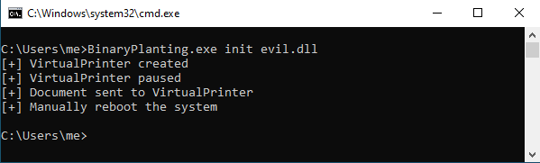
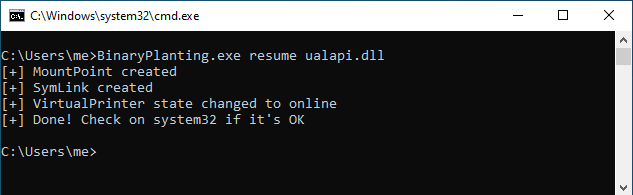

# CVE-2020-1337 - Binary Planting (CVE-2020-1048 bypass)

Peleg Hadar ([@peleghd](https://twitter.com/peleghd)) and Tomer Bar at SafeBreach ([@safebreach](https://twitter.com/safebreach)) were acknowledged by Microsoft by the [CVE-2020-1048](https://portal.msrc.microsoft.com/en-US/security-guidance/advisory/CVE-2020-1048), a Windows Spooler Vulnerability that allows an elevation of privilege on Windows 7 and later.

Some details were disclosed by Alex Ionescu ([@aionescu](https://twitter.com/aionescu)) and Yarden Shafir ([@yarden_shafir](https://twitter.com/yarden_shafir)) on his cool blog post [PrintDemon: Print Spooler Privilege Escalation, Persistence & Stealth (CVE-2020-1048 & more)](https://windows-internals.com/printdemon-cve-2020-1048/). Using this knowledge I found a bypass for the patch using Windows junction points and symlinks (kudos to James Forshaw [@tiraniddo](https://twitter.com/tiraniddo)).

My report was a dupe because the root cause was previously reported by [someone else](https://twitter.com/neosysforensics/status/1293191989635289088) and the report was assigned the [CVE-2020-1337](https://portal.msrc.microsoft.com/en-US/security-guidance/advisory/CVE-2020-1337), a really c00l CVE :-)

This C# code allows to place a malicious DLL to the local `C:\windows\system32` directory in order to be loaded by a DLL hijacking vulnerable application or service. 

Blog post: [CVE-2020-1337: my two cents](https://blog.hiveminds.es/en/posts/cve-2020-1337_my_two_cents/); also in [spanish](https://blog.hiveminds.es/es/posts/cve-2020-1337_mis_dos_centavos/).

## How to compile

Use Visual Studio in order to get a self-contained binary. The magic is done using the next Nuget packages:

- [NtApiDotNet](https://www.nuget.org/packages/NtApiDotNet/)
- [IlMerge 3.0.40](https://www.nuget.org/packages/ilmerge/3.0.40)
- [MSBuild.ILMerge.Task](https://www.nuget.org/packages/MSBuild.ILMerge.Task/)

## How to use

Place the binary and your malicious file in the same path and execute the first step:

Manually reboot the system and execute the second step to finally plant your DLL with its final name:

## Acknowledgements

- Alex Ionescu ([@aionescu](https://twitter.com/aionescu)) and Yarden Shafir ([@yarden_shafir](https://twitter.com/yarden_shafir))
- Peleg Hadar ([@peleghd](https://twitter.com/peleghd)) and Tomer Bar
- James Forshaw ([@tiraniddo](https://twitter.com/tiraniddo))
- BC Security ([@BCSecurity1](https://twitter.com/BCSecurity1))
- All the partners that help me testing the PoC: Marc ([@h4ng3r](https://twitter.com/h4ng3r)), Ignasi ([@Ny4nyi](https://twitter.com/Ny4nyi)), Iñaki ([@virtualminds_es](https://twitter.com/virtualminds_es)) and Hector ([@3v4Si0N](https://twitter.com/3v4Si0N)).

